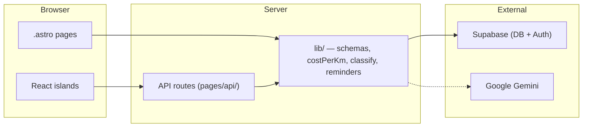
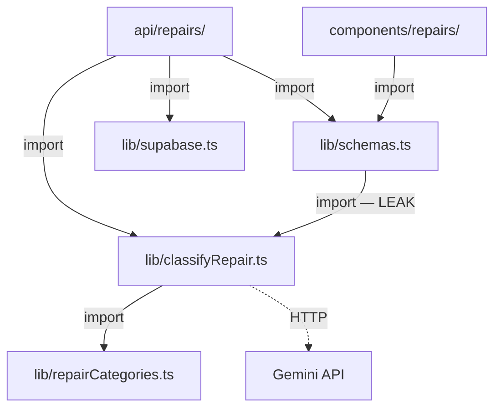

# Repo Map — Car Repair Tracker

> Synteza trzech artefaktów: territory (git 12 mies.), structure (dependency-cruiser + grep), contributors (git log).
> Data: 2026-06-18. Okno: 2025-06-18 → 2026-06-18.

---

## 1. TL;DR

Astro 6 SSR + React 19 islands + Supabase (auth + Postgres z RLS) + Tailwind 4. Użytkownik loguje się, dodaje pojazdy, rejestruje naprawy — app liczy koszt/km, klasyfikuje naprawy przez Gemini AI i pokazuje przypomnienia serwisowe.



**Gdzie skupia się praca:** trójkąt napraw (`api/repairs` + `components/repairs` + `lib/`) — 40 commitów łącznie. **Gdzie boli:** `vehicles/[id].astro` to god-page z 10+ importami; `types.ts` wymaga ręcznego sync z migracjami SQL; `schemas.ts` jest connektorem 13 obszarów i pewnym merge-conflict przy równoległej pracy. Projekt jest 100% single-contributor — cała wiedza domenowa w jednej głowie.

---

## 2. Teren — co duże, co peryferyjne, co się zmienia

### Moduły głębokie (dużo logiki, dużo zmian)

| Moduł | Commits | Dlaczego gorący |
|-------|:---:|-----------------|
| `src/lib/` (schemas, costPerKm, classify) | 14 | Serce logiki biznesowej. Każdy feature tu ląduje |
| `src/pages/api/repairs/` + `repairs.ts` | 13 | Najaktywniejszy endpoint — CRUD + AI classification |
| `src/components/repairs/` | 13 | UI lustro API napraw — formularz, lista, kategorie |
| `supabase/` (migracje + seed) | 16 | Ewolucja schematu DB. Każdy feature = nowa migracja |

### Moduły płytkie (stabilne / peryferyjne)

| Moduł | Commits | Charakter |
|-------|:---:|-----------|
| `src/pages/api/auth/` | 3 | Auth endpoints — ustabilizowane wcześnie |
| `src/components/ui/` | ~0 regularne | shadcn/ui primitives — drop-in, bez customizacji |
| `src/layouts/`, `Welcome.astro`, `Topbar.astro` | 2–3 | Bootstrap-era; wysoki "area score" to artefakt dużych commitów startowych, nie bieżąca aktywność |

### Aktywność w czasie

Dominujący wzorzec: feature-driven bursts. Naprawy (CRUD → AI classification → review fixes) to najdłuższa seria. Cost/km i service reminders to krótsze spike'i. Testy (API: 17 commitów, E2E: 12) rosną równolegle z feature'ami — to nie jest projekt "testy później".

---

## 3. Realne powiązania — co zmienia się razem i dlaczego

### Trójkąt napraw (import graph + co-change)



**Źródło:** graf importów (dependency-cruiser + grep) + co-change z gita (4 commity razem).
`schemas.ts` jest spoiwem — dzielona walidacja zod między API i UI. Sprzężenie uzasadnione (wspólny kontrakt), ale merge-conflict bottleneck przy pracy równoległej.

**Import leak:** `schemas.ts → classifyRepair.ts → GoogleGenAI + astro:env`. Importuje `REPAIR_CATEGORIES` przez re-export zamiast bezpośrednio z `repairCategories.ts`. Efekt: testy walidacji ciągną tranzytywnie Gemini SDK. Fix: 1 linia.

### Łańcuch propagacji schematu (co-change — 5 commitów razem)

```
supabase/migrations/*.sql  →  src/types.ts  →  lib/ + components/ + pages/
```

**Źródło:** co-change z gita. Ręczny sync — brak codegen z bazy. Prawie każda migracja SQL wymusza ręczną aktualizację `types.ts`, a potem propagację dalej. Nowa osoba musi znać tę sekwencję, bo żadne narzędzie jej nie wymusza.

### God-page `vehicles/[id].astro` (import graph + co-change — 6 commitów z lib/)

Fan-out 10+ z 5 modułów i 3 domen komponentów. Najsilniejsza para co-change w repo: `lib ↔ pages/vehicles` (6 commitów). Każda zmiana w logice biznesowej wymusza zmianę tego widoku. Brak warstwy pośredniej.

**Źródło:** dependency-cruiser (fan-out metric) + grep (.astro niewidoczne dla depcruise) + co-change git.

### Powiązania .astro — niewidoczne dla grafu

Dependency-cruiser nie parsuje `.astro`. Wszystkie importy między stronami a resztą repo ustalone grepem. To znaczy: **nie mamy pełnego grafu zależności warstwy stron** — znamy bezpośrednie importy, ale nie tranzytywne ścieżki przez .astro. Status: partially known.

### Supabase ↔ reszta — brak grafu

Między migracjami SQL a kodem TS nie istnieje formalny graf zależności (brak codegen, brak ORM z typami). Sprzężenie widoczne wyłącznie z co-change git. Status: **unknown** na poziomie importów, **known** na poziomie co-change.

---

## 4. Strefy ryzyka

| # | Strefa | Dlaczego ryzyko |
|---|--------|-----------------|
| 1 | **`schemas.ts`** — connector 13 obszarów | Merge-conflict magnet. Każdy feature dotykający napraw tu trafia. 7 commitów w 12 mies. |
| 2 | **`types.ts` ↔ `supabase/migrations`** — ręczny sync | Brak codegen = cicha rozbieżność typów i DB. 5 co-change commitów to dowód kosztu |
| 3 | **`vehicles/[id].astro`** — god page | 10+ importów, 3 domeny, 7 commitów. Równoległa praca = konflikty. Brak warstwy pośredniej |
| 4 | **`classifyRepair.ts`** — zamockowany w całości | Parsing odpowiedzi Gemini, timeout, fallback — ZERO coverage. Jedyny punkt styku z zewnętrznym AI |
| 5 | **`repairs/[id].ts`** — sekwencja 4 ops DB** | 179 linii, 3 endpointy, logika reklasyfikacji AI wpleciona w handler. Nie-atomowa sekwencja = ryzyko partial failure |
| 6 | **`RepairList.tsx`** — 6 commitów, 0 testów | `fetch()` + `window.reload()`. Jedyny aktywny komponent bez żadnego pokrycia |

---

## 5. Kogo zapytać

Projekt jest 100% single-contributor (**Maciej Szklarczyk**, 136 commitów, dwie tożsamości git). Nie ma drugiego eksperta — cała wiedza domenowa w jednej głowie.

| Strefa | Zapytaj | O co konkretnie |
|--------|---------|-----------------|
| Repairs trójkąt, schemas | Maciej | Sekwencja DB ops w PATCH, kontrakt walidacji zod, dlaczego classify jest re-exportowane przez schemas |
| Supabase migracje + RLS | Maciej | Konwencja nazywania, RLS policies per rola, seed data dla demo/e2e |
| God page `[id].astro` | Maciej | Które importy są load-bearing, plan rozbicia (jeśli jest) |
| AI classification (Gemini) | Maciej | Fallback behavior, retry policy, dlaczego mock całej funkcji w testach |

**Implikacja onboardingowa:** przy wchodzeniu drugiej osoby do repo, pair session na trójkącie napraw + łańcuchu propagacji schematu to minimum. Dokumentacja in-code jest minimalna (zgodnie z konwencją projektu).

---

## 6. Pierwszy dzień — pliki do przeczytania

Kolejność od szerokiego obrazu do detalu. Cel: zrozumieć architekturę, główny feature i łańcuch danych.

| # | Plik | Po co czytać |
|---|------|--------------|
| 1 | `CLAUDE.md` | Architektura, konwencje, path aliases, auth flow — mapa na 1 stronę |
| 2 | `src/types.ts` | Wszystkie entity types. Początek łańcucha propagacji |
| 3 | `src/lib/schemas.ts` | Connector #1 — zod schematy dzielone przez cały system. Widać kontrakty API |
| 4 | `src/pages/api/repairs/[id].ts` | Najgorętszy endpoint — CRUD + AI. Widać sekwencję DB ops i integrację z classify |
| 5 | `src/pages/dashboard/vehicles/[id].astro` | God page — widać jak strona agreguje dane z wielu domen. Wzorzec (i anty-wzorzec) w jednym |
| 6 | `src/lib/costPerKm.ts` + `__tests__/costPerKm.test.ts` | Pure function + wzorcowe testy. Benchmark "jak powinny wyglądać testy w tym repo" |
| 7 | `supabase/migrations/` (ostatnie 3 pliki) | Konwencja migracji, RLS, seed. Widać jak schema ewoluuje |
| 8 | `src/middleware.ts` | Auth flow + protected routes. Punkt wejścia security |

---

## 7. Ograniczenia

- **Okno czasowe:** 12 miesięcy (2025-06-18 → 2026-06-18). Wcześniejsza historia niewidoczna.
- **Graf importów:** dependency-cruiser nie parsuje `.astro` — warstwa stron uzupełniona grepem (bezpośrednie importy znane, tranzytywne nie).
- **Supabase ↔ TS:** brak formalnego grafu zależności między SQL a kodem. Sprzężenie widoczne tylko z co-change.
- **Lockfile'y, snapshoty, generowane pliki** odfiltrowane z analizy territory — co-change tych plików nie jest uwzględnione. Zmiany w `package-lock.json`, snapshotach testowych itp. to sprzężenie przez regenerację (tańsze niż ręczna edycja), ale tutaj niewidoczne.
- **Single contributor:** artifact-3 nie daje rozkładu wiedzy między osoby — bo jest jedna osoba. "Kogo zapytać" = zawsze ta sama odpowiedź.
- **Brak analizy runtime:** mapa nie mówi nic o performance, błędach produkcyjnych, ani zachowaniu pod obciążeniem. To mapa kodu i jego historii, nie systemu w ruchu.
